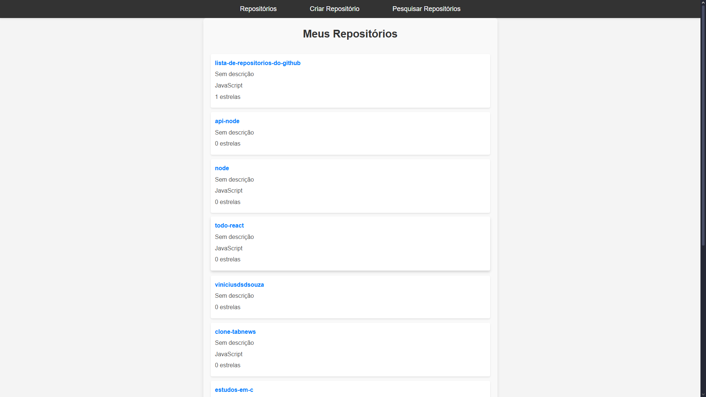
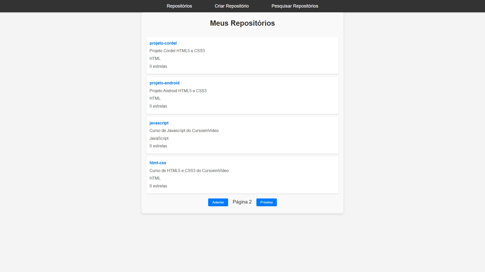
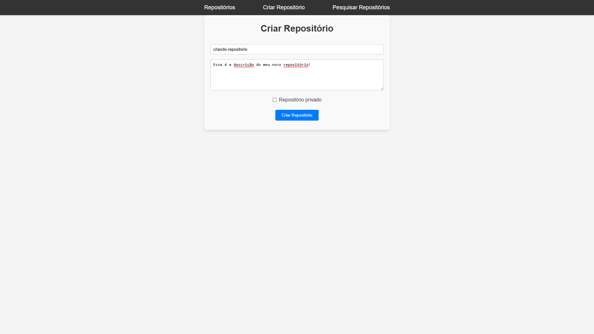
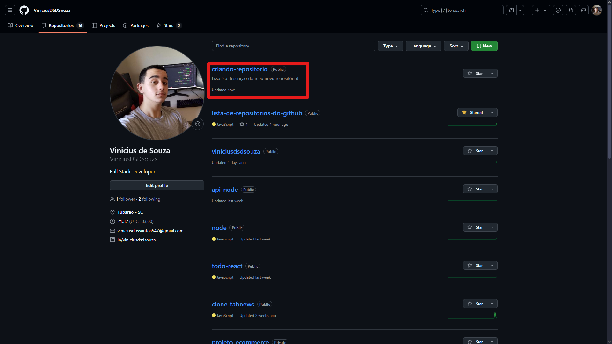
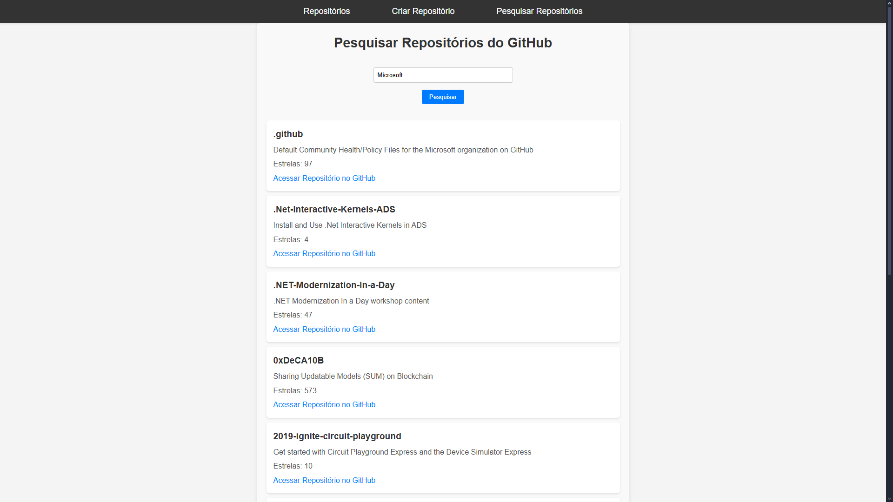

# Projeto Full Stack - Lista de Repositórios GitHub

Este é um projeto full-stack desenvolvido para autenticação via GitHub OAuth, permitindo a visualização e a criação de repositórios.

## Telas

### Login


Permite a autenticação do usuário via GitHub OAuth

### Meus Repositórios





Aqui, o usuário autenticado visualiza seus repositórios públicos

### Criar Repositório





O usuário pode criar novos repositórios diretamente da aplicação.

### Pesquisar Repositórios



Pesquisar repositórios GitHub de outros usuários.

## Estrutura do Projeto

- **Frontend**: Desenvolvido com React e Vite. Responsável por exibir os repositórios do GitHub, autenticar o usuário e interagir com o back-end.
- **Backend**: Desenvolvido com Express e Node.js. Fornece endpoints para autenticação do GitHub, criação de repositórios e manipulação de tokens JWT.

## 🛠 Tecnologias Utilizadas

### Frontend

- **React**: Biblioteca JavaScript para construir interfaces de usuário interativas.
- **Vite**: Ferramenta de build rápida e moderna para desenvolvimento com React.
- **React Router DOM**: Gerencia o roteamento da aplicação de forma eficiente.
- **Axios**: Biblioteca para fazer requisições HTTP.
- **js-cookie**: Gerenciamento de cookies para armazenar tokens.

### Backend

- **Express**: Framework minimalista para criar o servidor backend.
- **Axios**: Biblioteca para realizar requisições HTTP para a API do GitHub.
- **jsonwebtoken**: Geração e verificação de tokens JWT para autenticação.
- **dotenv**: Carrega variáveis de ambiente.
- **nodemon**: Ferramenta de desenvolvimento que reinicia o servidor automaticamente ao fazer alterações no código.

## 📦 Instalação

### Frontend

1. Navegue até o diretório do frontend:
   ```bash
   cd frontend
   ```
2. Instale as dependências:
   ```bash
   npm install
   ```
3. Acesse o frontend no seu navegador em [http://localhost:5173](http://localhost:5173).

### Backend

1. Navegue até o diretório do backend:
   ```bash
   cd backend
   ```
2. Instale as dependências:
   ```bash
   npm install
   ```
3. O servidor estará rodando em [http://localhost:3000](http://localhost:3000).

## ⚙️ Configuração

Certifique-se de configurar o arquivo `.env` na pasta `/backend` com as variáveis de ambiente necessárias.

**Exemplo de arquivo `.env`:**

```env
GITHUB_CLIENT_ID=seu_client_id_do_github
GITHUB_CLIENT_SECRET=seu_client_secret_do_github
GITHUB_JWT_SECRET_KEY=sua_chave_secreta

GITHUB_AUTH_URL=https://github.com/login/oauth/authorize?
GITHUB_ACCESS_TOKKEN_URL=https://github.com/login/oauth/access_token
GITHUB_CREATE_REPO_URL=https://api.github.com/user/repos
GITHUB_PAT=seu_personal_access_token

FRONTEND_REDIRECT_INDEX=http://localhost:5173
FRONTEND_REDIRECT_REPOS=http://localhost:5173/repos

ENDPOINT_CALLBACK=http://localhost:3000/auth/callback
```

## 💻 Endpoints

### 1. Autenticação via GitHub

- **GET /auth/github**  
  Redireciona o usuário para a página de login do GitHub.

### 2. Callback da autenticação

- **GET /auth/callback**  
  Recebe o código de autenticação do GitHub, troca por um token de acesso e armazena em um cookie.  
  Gera e armazena um JWT no cookie para autenticação futura.

### 3. Listar Repositórios do Usuário

- **GET /repos**  
  Retorna os repositórios públicos do usuário autenticado.  
  **Parâmetros**:
  - `username`: nome de usuário do GitHub.
  - `page`: número da página para paginação (padrão: 1).
  - `sort`: critério de ordenação (ex: stars).

### 4. Criar Repositório no GitHub

- **POST /repos**  
  Cria um repositório no GitHub.  
  **Corpo da requisição**:
  ```json
  {
    "name": "nome_do_repositorio",
    "description": "descrição_do_repositorio",
    "isPrivate": false
  }
  ```

## 📝 Scripts

- **npm run dev**: Inicia o servidor no frontend usando Vite.

## 🤖 Autenticação

Este projeto usa **GitHub OAuth** para autenticar os usuários e permite a criação de novos repositórios no GitHub. Os tokens de autenticação são armazenados em cookies e usados para realizar requisições autenticadas à API do GitHub.

## 🎯 Próximos Passos

- Implementar mais funcionalidades no painel de repositórios, como gerenciamento de favoritos.
- Melhorar a interface de usuário com Modo Escuro/Claro.
- Armazenar repositórios pesquisados no banco de dados para evitar muitas chamadas à API do GitHub.
- Adicionar testes unitários e de integração para o backend e frontend.

## Autor

Vinicius de Souza - Desenvolvedor Full Stack
